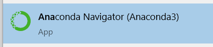
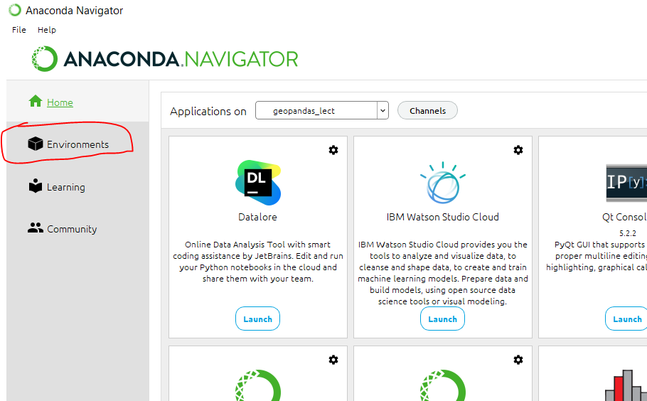
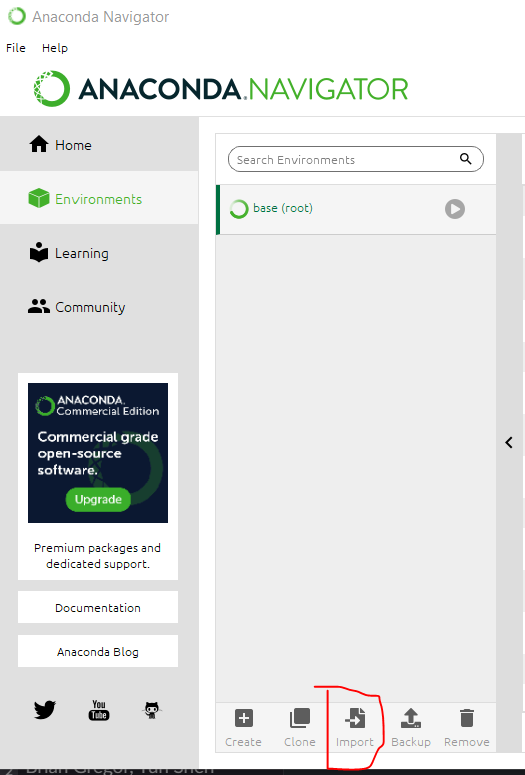
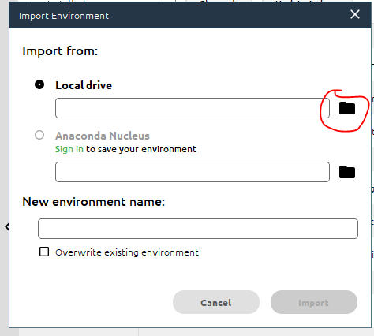
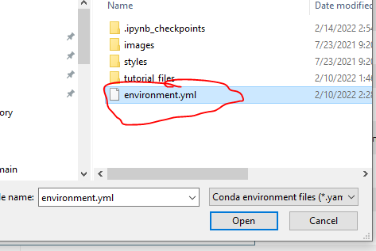
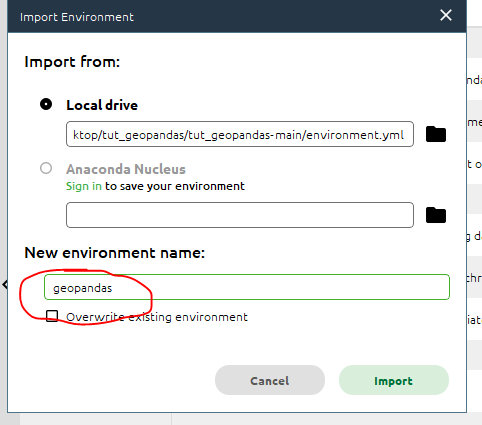
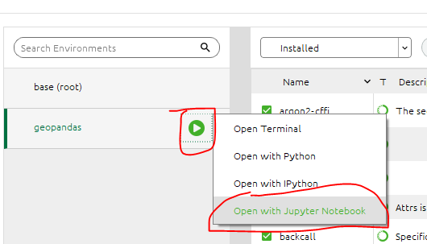

# Setting up GeoPandas Conda Environment

1. Use Git to clone this repository. Or download a zip file of this repository by clicking on the green "Code" button and then clicking "Download ZIP" in the pop-up menu.  
    
1. If you downloaded the zipfile, unzip the contents to a location you will remember, such as your Desktop.
1. Go to the anaconda website and install Anaconda on your machine: https://www.anaconda.com/products/individual  
1. Start the “Anaconda Navigator” Application.  The icon will look similiar to the snippet below:  
    
1. After the "Anaconda Navigator" window appears, on the left tab, click on “Environments” tab.  
    
1. At the bottom of the middle pane, click on “import”.  
    
1. A new window will appear.  Click on the folder icon on the right side, under “local drive”.   
    
1. Navigate to the download tutorial file on your Desktop and select “environment.yml” file and then click on open.  
    
1. Under “New Environment Name:” type in “geopandas”.  
    
1. Click “Import”.  The creation of the conda environment can take a while, 5- 10 minutes. On Windows, you may see the terminal (black window) randomly open and close on your machine.  
1. After the environment is created the name of the environment ("geopandas") will be listed on the left pane.  Click on the green arrow next to the "geopandas" environment name and in the pop-up window click on “Open with Jupyter Notebook”.  
    
1. This start the Jupyter Server and will open an internet browser on your machine, opening the home page for Jupter.  
1. Using the file explorer in the homepage, navigate to the git repository folder you cloned, or downloaded and unzipped. Click on “Intro_CRS_w_GeoPandas.ipynb”, to open the notebook.  
    
